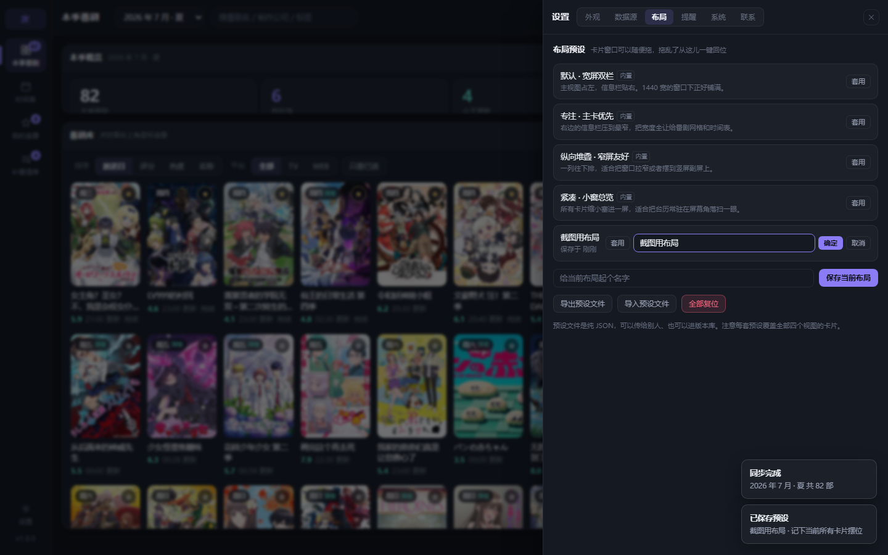

# 次回 · jikai

> 一个只服务于「一个人追番」的 Windows 桌面小工具。
> 把本季番剧、播出时间表、更新倒计时、补番 deadline 收进一屏，不用再开五个网站对着看。

**v1.0.0** · MIT · 自带 2026 年 4 / 7 / 10 月三个季度共 219 部真实番剧数据，**离线开箱可用**

仓库：[liamzhong-dev/jikai-anime-schedule](https://github.com/liamzhong-dev/jikai-anime-schedule)


---

## 它解决什么问题

追番这件小事，麻烦从来不在「看」，而在「记」：

- 本季有四十多部，我追的哪几部、各自播到第几话了，散在三个网站里；
- 播出时间表用的是日本时间，日本「周三 25:30」在北京时间其实是周四 00:30 —— 按日本日期排表，整张表会集体错一天；
- 深夜档（凌晨 0 点到 6 点）才是真正守着看的时段，可大多数时间表把它折叠在「前一天」里，翻不到；
- 补番永远在「快下架了」「BD 要出了」「我给自己定的 deadline 到了」之间反复拖延，缺一个能一眼看见「还剩几天、还剩几话」的地方。

这个工具只做这几件事，并且做扎实。

---

## 功能点清单

### 一、本季番剧库
- 按季度（冬 / 春 / 夏 / 秋）切换，季度标签写成「2026 年 10 月 · 秋」这种一眼能认的形式；
- 每张卡片显示：封面（真实封面加载失败或没有时，按标题生成渐变色块）、中日文名、制作公司、评分、追番状态；
- 卡片右上角星标一键追番 / 取消，不用进详情页；
- 顶部搜索框实时过滤，命中中日文名、制作公司、标签任一即可。


### 二、播出时间表
- **固定从周一开始排的七天视图**，今天那一列高亮，并标出日期（如 `9/22`）；
- **按北京时间归组**，不是日本时间 —— 因为用户是坐在北京时间的夜里等更新；
- **深夜档单独成块**：当天 18:00 到次日 06:00 会播什么，单独列出来。日本「25:30」这类档期换算过来正好落在这段里，不会被切掉；
- 右侧「今日更新」按时刻排序列出今天全部排播。

### 三、追番队列
- 按「下一次更新时间」排序，**已更新的排最前**，一眼看到该看哪个；
- 每条显示倒计时（`2 天后` / `5 小时后` / `18 分钟后`），已过期的转成「N 小时前已更新」；
- **区分「我落后了」和「番停更了」**：前者提示「攒了 N 话没看」，后者不报警；
- 支持「在看 / 想看 / 搁置 / 弃了」状态；标记搁置或弃了会自动关掉提醒，不再打扰；
- 右下角「追番分布」用七格小条形图显示本周哪天有更新。


### 四、补番清单
- 每部一张 deadline 卡，**三档配色**：已逾期（红）/ 三天内（黄）/ 时间宽裕（灰），已补完转暗色；
- 进度条直观看「还剩几话」，卡上显示剩余天数；
- 排序规则：逾期优先 → deadline 近的在前 → 已归档沉底；
- 逾期数量在侧边栏和概览里单独计数，想忽略也忽略不掉。


### 五、卡片式可拖拽布局 + 布局预设
- 每个视图由若干「窗口卡片」组成，**可以拖着换位置、拖右下角改大小**；
- 拖完的位置和尺寸自动保存，下次打开还是你摆的样子；
- 窗口变窄（< 1180px）时自动堆叠成单列，不出现横向滚动条。

拖乱了想回到能用，所以除了自动保存，还给了 **4 套内置预设**（默认宽屏双栏 / 专注主卡优先 / 纵向堆叠 / 紧凑小窗总览），一键切换：


- 也可以把当前摆位存成自己的预设，支持重命名、删除；
- 预设能导出成 JSON、再导回来 —— 换电脑时不用重新拖一遍。

### 六、九套配色主题
一份参考配色方案里挑了八套，加上本作最初的那套深色，一共九套，按用途分成三组：


| 分组 | 主题 |
| --- | --- |
| 本作默认 | 夜航（深蓝黑 + 紫青，夜里等更新不刺眼） |
| 主流简洁 | Linear 极客黑 / Notion 柔和白 / Raycast 深邃蓝 / Stripe 清爽紫 |
| ACG 风格 | 赛博霓虹 / 樱雪和风 / 马卡龙萌系 / 机甲战术风 |


主题表里**只声明原始色值**，派生量（RGB 三元组、柔和底、阴影、圆角三档、浅色/深色方案）统一由 `computeThemeVars()` 算出来注入 CSS 变量。所以加一套主题是往数组里加一条，不用碰样式文件；换主题也不会闪一下再对上色。

顶栏有个换肤按钮可以快速轮换，`T` 键同样。

### 七、自定义窗口壁纸
- 选一张本地图片做窗口背景，自动缩到长边 1920 再转成 JPEG/PNG；
- **参数可调**：不透明度 / 模糊 / 亮度 / 缩放 / 位置（中上下左右）/ 暗角，六个都带实时预览；
- 卡片和侧栏的不透明度可以单独压低，让壁纸「透出来」而不是被糊住 —— 侧栏顶栏自动比卡片更实一点，否则整个界面会飘。


壁纸是 base64 大字符串，**单独存在 `wallpaper.json`**，不混进 `state.json` —— 否则每次自动落盘都要重写几 MB。

### 八、托盘常驻 / 开机自启 / 全局快捷键
提醒功能如果只在窗口开着时有效，那基本等于没有。所以：

- 关窗**不退出**，收到托盘继续跑；最小化也收托盘（两项都能关）；
- 托盘右键菜单里能直接跳视图，并显示**今天有几部更新、待补几部、几部已逾期**（数字由渲染层推给主进程，主进程不去理解业务）；
- 开机自启走 `setLoginItemSettings`，启动参数带 `--hidden`：**开机后静默进托盘，不弹窗**；
- 全局快捷键（默认 `Ctrl+Shift+A`）在任何窗口下都能呼出 / 收起主窗口；被别的程序占用会明确告诉你，而不是静默失效。


### 九、快捷键
`?` 随时呼出快捷键帮助浮层：


`1/2/3/4` 切视图、`/` 聚焦搜索、`R` 同步、`Esc` 清空或关弹层、`T` 换配色、`B` 开关壁纸、`L` 布局预设、`,` 设置、`Ctrl+R` 刷新。
光标在输入框里时，单字符快捷键自动让路（`Esc` 和 `Ctrl` 组合除外 —— 搜完按 Esc 没反应很恼人）。

### 十、数据来源（三档，设置里切）

| 模式 | 说明 |
| --- | --- |
| **自带数据（默认）** | 打包时就带上 **2026 年 4 / 7 / 10 月三个季度共 219 部**真实番剧，**离线可跑、不联网、不用开代理**。装好第一次打开就有内容 |
| bangumi-data | 拉 [bangumi-data](https://github.com/bangumi-data/bangumi-data) 真实番剧表（CC BY 4.0），按季度过滤。**不含**话数 / 评分 / 封面 |
| bangumi-data + Bangumi API | 在真实排播基础上，用 Bangumi v0 API 补齐话数、评分、封面、简介、制作公司 |


**自带数据是真的，不是演示。** 它由 `npm run builtin` 生成：先取 bangumi-data 的快照，再用 Bangumi v0 API 逐条补全话数 / 评分 / 封面 / 简介 / 制作公司，落成 `src/data/builtin/{season}.js` 并随仓库一起提交。所以「离线也能看到真番剧」和「数据是编的」这两件事不再矛盾 —— 之前那份全虚构的数据已经移到 `test/fixtures/`，只服务测试，不随产品发布。

生成脚本可以指定季度，也可以完全不联网（只用已有的快照）：

```bash
npm run builtin                      # 默认：当前季度 ± 1 季
node scripts/build-builtin.mjs --seasons=2026q4,2027q1
node scripts/build-builtin.mjs --offline --no-enrich
```

新一季度开播后想更新随包数据，就重跑一次 `npm run builtin` 再提交，改动只落在 `src/data/builtin/` 里（一季约 80–115KB，三个季度不到 300KB）。

选中需要联网的源时，**选项正下方会挂出一条「先开 VPN / 系统代理」的提示**。国内直连 `api.bgm.tv` 的典型症状是「域名能解析、TCP 直接超时」，不写清楚的话，用户只会以为同步坏了。

三种源的差别全压在 `loadSeason()` 一个函数后面，界面只给进度回调和一句降级说明。加「本地 JSON 导入」之类的第四种，只需要在这里多一个分支。

**补全**是并发 3、每条间隔 120ms、一季最多 60 部 —— 官方不建议打太猛。只写入「确实拿到了」的字段，取不到就留空，不用假数据把界面填满。

**降级必须说清楚**。联网源出问题时都会在界面顶部出一条横幅，写明白现在看到的到底是什么：

| 降级 | 横幅文字 |
| --- | --- |
| 选了联网源但完全拉不到，退回自带数据 | 真实数据源不可用，已回退到自带数据（原因） |
| 连自带数据里也没有这一季 | 这一季没有自带数据，联网同步试试（原因） |
| 网络不可用但有旧缓存 | 网络不可用，暂用上次缓存（原因） |
| 排播表拿到了但补全全失败 | 补全失败，只拿到了排播表（原因） |

否则用户会以为看到的是真实数据 —— 这比报错更糟。

**「默认不联网」是刻意的。** 国内直连 `api.bgm.tv` 常常不通（见下面「关于数据」），如果默认就去联网，第一次打开软件的人会看到一个空白界面加一条报错。自带数据把这条最差路径直接消掉了：先有东西看，想看更新的再自己去开代理同步。

### 十一、季度缓存会自己长大，所以要能清
- 一个季度的完整番剧表（含简介和标签）单独放在 `cache` 字段里，和「追番 / 补番 / 布局」这些用户数据**分开存**。用户数据丢了是灾难，缓存丢了只是重下一遍；
- 设置里能看见每个季度缓存多大、什么时候存的、补全了多少条，可以**单个清**，也可以**全部清**；
- 最多保留 10 个季度，超了按时间淘汰最旧的；
- 简介截断到 420 字、标签最多 8 个 —— 不这样瘦身，一个季度能把 `state.json` 撑到几 MB。

### 十二、自动更新（检查 + 下载）—— **入口暂时隐藏**

这项**实现是完整的**（四层链路都通、有测试），但眼下没有安装包、也没有发布渠道，点下去只会回一句「未配置更新源」。所以先把界面入口收起来了。**v1.0.0 仍然如此 —— 发布出去的是源码，不是安装包。**

**代码一行没删。** 要恢复：把 `src/core/features.js` 里的 `autoUpdate.visible` 改成 `true`，设置面板里那一节和托盘右键菜单会一起回来。

实现细节（留着备查）：

- 更新源既可填自定义 manifest JSON（`{ version, notes, url, sha256 }`），也可填 GitHub Releases；
- 填 GitHub 网页地址就行，`github.com/owner/repo/releases/latest` 会被自动翻成 `api.github.com/repos/...` —— 不该要求用户记住 API 域名那一段；
- 启动时自动检查一次（可关）；发现新版本时横幅变样、托盘菜单多一项、点「前往下载」交系统浏览器；
- 版本比较、跳过某个版本这些判断是纯函数（`core/update.js`），有测试覆盖。想升级成「下载完自动替换」时，换上 electron-builder + electron-updater 就行，判断逻辑和界面都不用动。


> 关于「隐藏入口」这件事：藏起来的开关统一收在 `src/core/features.js`。
> 每个被隐藏的功能都必须写上 `reason`（有测试卡着），免得半年后没人记得为什么藏。
> 界面不渲染入口，但底层能力、IPC 通道、测试全部保留 —— 所以恢复时只是「把门打开」，
> 不需要重新验一遍逻辑。当前被隐藏的功能会显示在设置 → 系统 → 关于里。

### 十三、其它界面

详情抽屉（点任意卡片打开，含简介、标签、话数、外链）：


同步时顶部会有真实进度的进度条，而不是一个转圈的图标：


窗口窄到 1180px 以下时，卡片自动改成纵向堆叠，不出现横向滚动条：


外观设置页（主题网格 + 壁纸滑块）：


预设改名走行内编辑，不弹系统对话框 —— Electron 里 `window.prompt` 一调用就抛异常：



---

## 技术栈

| 层 | 选型 | 说明 |
| --- | --- | --- |
| UI | React 18 | 纯函数组件 + Hooks，无 UI 框架依赖 |
| 构建 | Vite 5 | 产出单页 `dist/`，Electron 直接加载本地文件 |
| 桌面壳 | Electron 33 | 主进程 / 预加载脚本分离，`contextIsolation` 开启 |
| 状态 | 自研轻量 store | 订阅式，不引 Redux |
| 自带数据 | 构建期生成 | `npm run builtin` 抓取 + 补全后落成 JS 模块，随包发布，离线可用 |
| 测试 | `node --test` | 101 个用例，含 6 个 SSR 渲染断言 |
| 真实验证 | `npm run live` | 拿 api.bgm.tv 的真实响应跑一遍补全，直连 / 走代理自动探测 |
| 图标 / 壁纸 | 零依赖 PNG 编码器 | 手写 IHDR+IDAT+IEND，不引 sharp / canvas |

**运行时依赖只有 React 和 React-DOM 两项**，其余全在 devDependencies。

```
jikai/
├─ 启动次回.bat      双击启动器（内容全 ASCII，中文提示交由 node 打印）
├─ LICENSE              MIT
├─ electron/
│  ├─ main.cjs          主进程：窗口、托盘、单实例锁、外链白名单、IPC
│  ├─ preload.cjs       只暴露具名方法，不把 ipcRenderer 整个丢出去
│  ├─ net.cjs           网络通道：走 Chromium net 栈，自动跟随系统代理 / VPN
│  ├─ tray.cjs          托盘常驻与动态菜单
│  └─ updater.cjs       自动更新取数（判断逻辑在 src/core/update.js）
├─ src/
│  ├─ App.jsx           视图编排、数据加载、提醒定时器、托盘摘要推送
│  ├─ core/
│  │  ├─ time.js        时区换算、周期解析、watchState 状态推算
│  │  ├─ schedule.js    周视图 / 深夜档窗口 / 未来 N 天
│  │  ├─ catchup.js     deadline 分档、进度、排序
│  │  ├─ store.js       用户数据 + 季度缓存 + 设置
│  │  ├─ hotkeys.js     快捷键表 + KeyboardEvent 归一化
│  │  ├─ layoutPresets.js  内置布局预设
│  │  ├─ wallpaper.js   图片读取、缩放、体积校验
│  │  ├─ update.js      版本比较、更新源归一化、GitHub 地址翻译
│  │  ├─ features.js    功能开关：藏入口不删代码（自动更新暂时藏在这里）
│  │  ├─ version.js     版本号唯一来源
│  │  └─ filters.js     搜索 / 筛选 / 排序
│  ├─ data/
│  │  ├─ builtin/       随包发布的真实数据（三个季度 · 219 部）+ 索引
│  │  ├─ slim.js        条目瘦身（简介截断、标签限量），构建脚本与运行时共用
│  │  ├─ bangumiData.js 静态番剧表适配器
│  │  ├─ bangumiApi.js  Bangumi v0 API 客户端（并发池 / 解析 / 诊断）
│  │  └─ sources.js     数据源抽象：三种源收成一个 loadSeason()
│  ├─ theme/            主题表 + CSS 变量计算
│  ├─ platform/index.js 平台适配器：web 与 electron 两套实现
│  ├─ components/       17 个组件
│  └─ styles.css        单套设计令牌（全部走 CSS 变量）
├─ scripts/             图标生成 / 壁纸生成 / 自带数据生成 / 无头截图 / 真实网络验证
│  ├─ build-builtin.mjs 生成 src/data/builtin/（npm run builtin）
│  ├─ screenshot.cjs    无头截图（npm run shoot）
│  ├─ live-check.mjs    真实 api.bgm.tv 端到端验证（npm run live）
│  └─ lib/proxyfetch.mjs 零依赖的「可走代理」HTTP 客户端，只服务命令行验证
└─ test/                核心逻辑 + 自带数据 + 更新 + 渲染测试
   └─ fixtures/         全虚构数据与 SSR 入口，**只服务测试，不进产品**
```

---

## 时间与状态的判定口径

### 1. 时区：`begin` 是 UTC，但「星期几」必须按 JST 取

数据里长这样：

```json
{ "begin": "2026-10-07T15:00:00.000Z", "broadcast": "R/2026-10-07T15:00:00.000Z/P7D" }
```

`15:00Z` 在日本是**次日 00:00**，属于深夜档。如果直接拿 UTC 取日期，整张时间表的星期会集体错一天，周日那一列还会永远空着。

所以分了三层换算：

- **星期** → 按 JST(+09:00) 取，因为这是日本电视台的排播习惯；
- **归组 / 显示** → 按 CST(+08:00) 取，因为用户坐在北京时间里；
- **深夜档** → 按 CST 的 00:00–06:00 判定，而不是 JST。

### 2. 「下一集」一个值不够用

「番还在播但我落后了」和「番已经播完了」是两件事：前者该催着补，后者不该再报「下一集」。所以抽出一个 `watchState()`，一次给出五个数：

```js
{
  next,        // 下一次更新（时刻 + 第几话），无重复规则时为 null
  airedCount,  // 按时间推算已经播到第几话
  latest,      // 已播出的最后一集
  behind,      // 已播但还没看的集数  ← “我落后了”
  finished,    // 整部是否播完
}
```

界面上的「攒了 N 话没看」和「已完结」就是从这里分出来的。

### 3. 「接下来 7 天」只收还没播的

`upcomingWithin()` 只收 `next.ms > nowMs` 的条目 —— 否则三小时前刚更新过的番也会被列进来，倒计时显示成「3 小时后」，方向反了。

---

## 快速开始

需要 Node 18+。

### 方式一：双击启动（最省事）

直接双击项目根目录里的 **`启动次回.bat`**。

它会自己检查环境：缺依赖就先 `npm install`，缺前端产物就先 `npm run build`，然后弹出桌面窗口。第一次跑要等几分钟装依赖，之后就是秒开。出错时窗口会停住并把提示留在屏幕上，不会一闪而过。

> 这个 `.bat` 是 **GBK(cp936) 编码 + CRLF 换行**，跟简体中文 Windows 的 cmd 原生一致。
> 用编辑器改它时**不要另存为 UTF-8** —— UTF-8 批处理在 cmd 里会按字节错位，
> 中文提示乱码还是小事，`rem` 注释行会被当成命令去执行。这是踩过的坑，写在文件头部注释里了。

### 方式二：命令行

```bash
npm install

npm run desktop    # 起 Electron 桌面窗口（托盘 / 自启 / 全局快捷键都在这里生效）
npm run dev        # 浏览器里调 UI（走 localStorage 与页面内提示，系统能力自动降级）
npm test           # 101 个用例
npm run builtin    # 重新生成随包数据（默认当前季度 ±1 季，会自动探测本地代理）
npm run live       # 拿真实 api.bgm.tv 验证补全链路（会自动探测本地代理）
npm run live:shot  # 真数据渲染一张界面图，产出到 local-data/（已 gitignore，不进仓库）
npm run build      # 产出 dist/
npm run assets     # 重新生成图标与示例壁纸
npm run shoot      # 构建 + 无头截图到 screenshots/（需本机有 Chrome 或 Edge）
```

> 注意： 不要直接双击 `dist/index.html`。虽然打包用了相对路径，但 `<script type="module">`
> 走 `file://` 会被 Chromium 的 CORS 拦掉，页面白屏。必须在 HTTP 下打开
> （双击启动器 / `npm run dev` / Electron 三种都行）。

浏览器里跑（`npm run dev`）时，托盘、开机自启、全局快捷键、壁纸这四项会自动降级：
接口仍在，只是返回「这个环境不支持」。**业务层不需要知道自己在哪个壳里。**
（自动更新的接口也在走同一条降级路径，但它的入口现在整块隐藏了，所以浏览器里也见不到。）

> 另外，浏览器里能不能连上 `api.bgm.tv` 取决于**浏览器自己**有没有走系统代理 ——
> 桌面版是主进程的 Chromium net 栈去连，行为不完全一样。要验证真实数据，请用桌面版。

---

## 关于数据

**默认数据是真的。** 随包发布的 `src/data/builtin/` 收录了 2026 年 **4 月 / 7 月 / 10 月三个季度共 219 部**作品，条目全部来自真实番剧表，不是编的。

- 番剧表来自 [bangumi-data](https://github.com/bangumi-data/bangumi-data)（CC BY 4.0），`src/data/bangumiData.js` 负责把它适配成内部结构；
- 话数 / 评分 / 封面 / 简介 / 制作公司由 Bangumi v0 API（`/v0/subjects/{id}`）补全，`src/data/bangumiApi.js` 负责并发抓取与解析；
- **封面图不打包进仓库**，界面里是直接引用 Bangumi 图片站（`lain.bgm.tv`）的 https 直链。网络不通时按标题本地的生成渐变色块兜底，不会留一块破图；
- 本作与 Bangumi 官方无关。条目数据版权归原作者与 bangumi-data 项目所有，封面图版权归各自权利人所有；
- 外链功能会打开 Bangumi 条目页与萌娘百科搜索页，仅用系统默认浏览器打开，不做内置 webview。

测试用的虚构数据单独放在 `test/fixtures/fictional-data.js`，**只用于测试，不进产品**。

想更新随包数据，重跑 `npm run builtin` 再提交即可；改到的只有 `src/data/builtin/` 一个目录。

### 网络：api.bgm.tv 在国内常常连不上

`api.bgm.tv` 在国内一些网络环境下连不上（域名能解析，但 TCP 直接超时），需要走代理。

**`npm run live`** 一次做完下面这些：

1. 自动探测本地代理端口（Clash / mihomo / v2rayN 这类常见的都试一遍；也可以用 `JIKAI_PROXY` 直接指定）；
2. 用项目里的 `diagnose()` 挨个探端点，打印耗时与返回样例；
3. 拉真实 `/calendar`，取 12 部在放番剧；
4. 用项目里的 `enrichItems()` 真的补全一遍；
5. 断言话数 / 评分 / 封面 / 制作公司都拿到了，**并且真的去下载一张封面图**，确认不是死链。

没有代理时加 `--offline`，改用上次抓下来的快照跑解析回归，完全不联网：

```bash
npm run live            # 联网跑完整验证
npm run live:offline    # 只用本地快照，回归解析逻辑
```

**网络不通时的三条路**：

1. **开 VPN / 系统代理** —— 桌面版的请求走 Electron 主进程的 Chromium net 栈，**自动跟随系统代理**，不用在本作里改任何配置；
2. **指定代理** —— 设置 → 数据源里填 `http://127.0.0.1:7890` 这种地址，主进程会 `setProxy` 让整个会话都走它；
3. **自建反代** —— 填一个自建地址（Cloudflare Worker / Vercel 之类），优先级最高。安全边界是**只放行 https**，http 仅允许本机 —— 给本地反代留口子，但不给被劫持留口子。

设置里有「诊断」按钮逐个试端点，并把 Chromium 的 `ERR_*` 错误码翻成人话（「连接超时（网络不通，或被墙 / 需要开代理）」这种）；旁边「试一条」填个条目 id 就能看到真实返回被解析成了什么。

选中需要联网的数据源时，选项正下方会直接挂出一条提示，写明**先开 VPN 再同步**；同步失败导致降级时，横幅里也会带上「检查 VPN / 代理」的话 —— 不然用户只会以为程序坏了。

## 已知限制

- 只做了 Windows 一期；macOS / Linux 未验证（代码里没有平台硬编码，理论可跑）；
- **没有安装包**。`npm run desktop` 或双击 `.bat` 直接起，所以自动更新只能做「检查 + 跳去下载」、没有静默替换；**当前这一项的入口是隐藏的**（见上面第十二节，开关在 `src/core/features.js`）；
- **开机自启在开发模式下注册的是 electron.exe 本身**，所以代码里显式把项目目录塞进了启动参数。打包成安装包后这段逻辑才真正干净；
- 托盘图标只有一种状态，没有按「今天有几部更新」换图标；
- 换主题没有过渡动画；
- 壁纸单张上限约 3.2MB（base64 后会膨胀约 1/3），且只存一份、不分视图 —— 每个视图一套壁纸会让状态文件迅速变大。

## 许可

代码以 MIT 许可发布，见 [LICENSE](LICENSE)。

随包数据（`src/data/builtin/`）来自 bangumi-data（CC BY 4.0）与 Bangumi v0 API，版权归原作者所有；
封面图不随包分发，界面内直接引用其原站直链。仓库内不含任何虚构的「演示产物」冒充真实数据。
