# 次回 · jikai

[](https://github.com/liamzhong-dev/jikai-anime-schedule/releases)
[](https://www.electronjs.org/)
[](https://react.dev/)
[](https://vitejs.dev/)
[](https://github.com/liamzhong-dev/jikai-anime-schedule/releases)
[](./LICENSE)

Windows 追番桌面小工具。本季番剧、播出时间表、更新倒计时、补番 deadline 放在同一个窗口里。

自带 2026 年 4 / 7 / 10 月三个季度共 219 部真实番剧数据，连这些番剧的封面一起随包带上，装完打开即可查看，第一次打开不联网也有图。名字的「次回」取自日语里的次回予告，也就是下集预告。

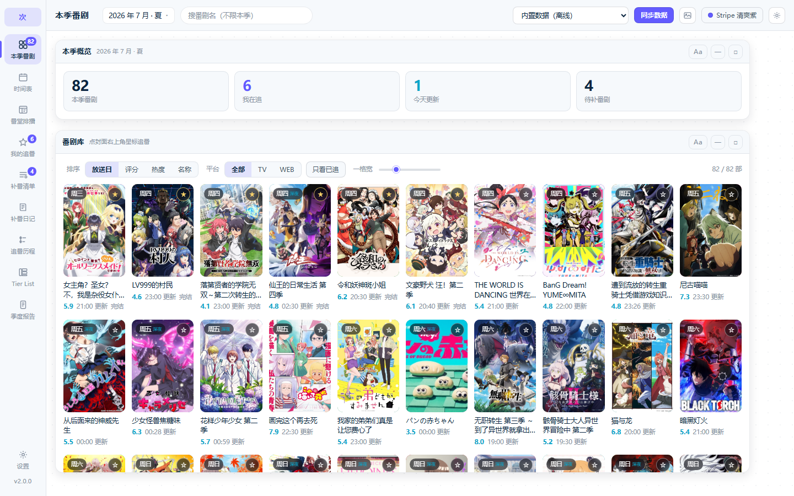

## 下载

到 [Releases](https://github.com/liamzhong-dev/jikai-anime-schedule/releases) 拿最新的 `jikai-<版本>-setup.exe`，双击安装即可运行。安装包没有代码签名证书，Windows 第一次运行会弹 SmartScreen 的「未知发布者」，点「更多信息 → 仍要运行」即可。这一步躲不掉，除非买证书。

不想装东西也可以跑源码，见下面「运行」。

## 更新记录

### 2.3.0

- 季度报告：封面改用原图那一档
- 季度报告：奖项封面大小、每块正文字号都能单独调，导出倍率有跟随屏幕 / 1x / 1.5x / 2x 四档
- 季度报告：新增自定义图片块，可以放插画和截图
- Tier List：自定义模板里可以加自己的图
- 修掉导出长图时偶尔少几张封面

### 2.2.0

- 界面随窗口大小连续变化：窗口拉大时字、封面、间距和卡片本身一起变大
- 卡片摆位按画布等比缩放，最大化之后版面跟着铺满
- 原来的「封面尺寸 / 文字大小」两档保留，含义变成在自动的基础上再偏一点；设置里可关掉跟随窗口

### 2.1.0

- 番堂排播：封面改走图床缩略图并显示缓存进度；新增换季下拉、开播提醒、补番日记联动
- 番堂排播：详情页封面改走图床缩略图
- 长图 PNG 导出改为整张一次截图，并显示导出进度
- 季度归档改为按开播日期判定（12 月末开播算次年 1 月番），半年番同时归入起始季与后续季，网络放送番计入当季
- 每日放送改为读本地归档，往季新番也能排进时间表
- Tier List 候选改为当季新番全量

## 功能

### 本季番剧

按季度（冬 / 春 / 夏 / 秋）切换，卡片显示封面、中日文名、制作公司、评分。顶部搜索框按中日文名、制作公司、标签实时过滤。跨季度搜索能认 `2011`、`2011q3`、`2011 年 7 月`、`秋` 这类写法，也能搜到内置数据之外的季度。点卡片右上角星标加入或取消追番，点封面或标题打开详情。封面取不到时按标题生成渐变色块。

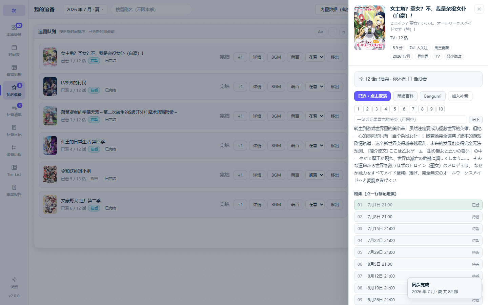

### 播出时间表

周一开始的七天视图，今天那一列高亮并标出日期。时间换算到北京时间，日本写的「周三 25:30」会落到周四凌晨那一格。当天 18:00 到次日 06:00 的深夜档单独成块列出。右侧「今日更新」按时刻排出当天所有排播。

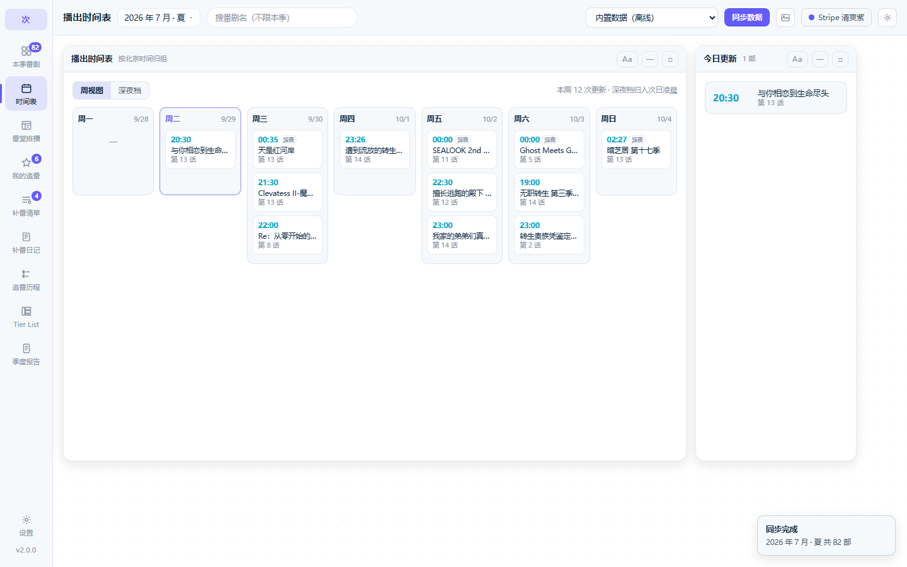

### 番堂排播

[长门番堂](https://yuc.wiki/) 整理的当季排播表，按周一到周日加「网络放送 & 其他」八组铺开，每条显示放送时刻、首播日期和封面，点开看原名、改编类型、题材标签、制作名单、声优和官网 / PV。

能对上自己库的条目会标一个「已收入」，并多出两件事：把番堂的「周几 + 几点」接进更新提醒，以及直接在旁边写补番日记。季度也能换（下拉里是最近几季）。

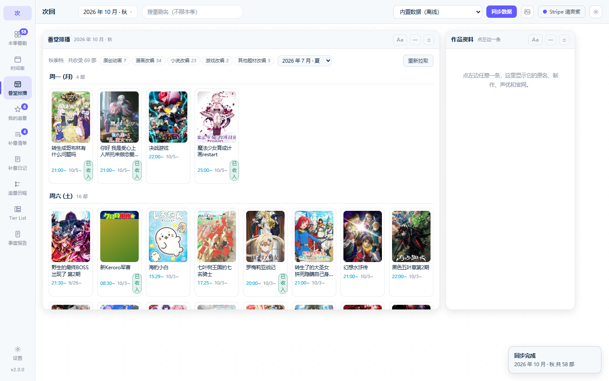

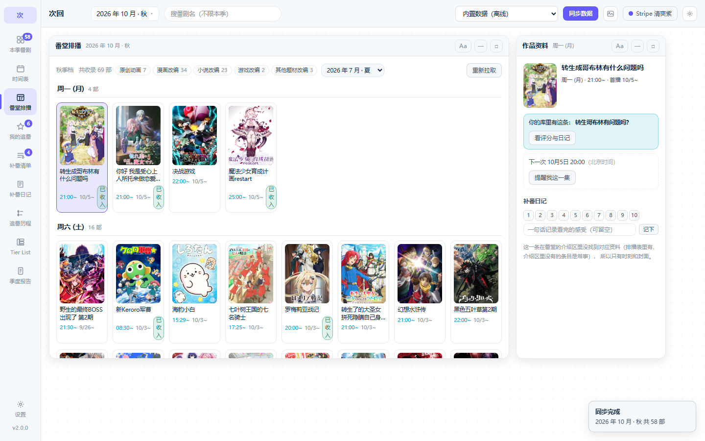

数据来源：[长门有C（yuc.wiki）](https://yuc.wiki/)。

它和「播出时间表」是同一件事的两种口径：一张是按自己的库算出来的（谁在第几话、什么时候更新），一张是整理好的全量排播（连没入库的也在）。两边不合并，各用一个出处。

排播数据进入这一页时才取，优先用本地缓存：拉过一次之后，一天开十几次也只请求一次。强制刷新按右上角「重新拉取」。断网时显示上次的结果，并标注不是最新的。

和自己的库对得上的条目会标「已收入」，并在右侧给一条通回 Bangumi 详情的出口（评分、话数、日记都在那边）。

### 追番队列

按下一次更新时间排序，每条显示倒计时，形如「2 天后」「5 小时后」「18 分钟后」，已播出的转成「几小时前已更新」。积压的提示「攒了 N 话没看」，已完结的不提示。每条可设为在看、想看、搁置、弃了，搁置和弃了不再提醒。右下角七格条形图显示本周每天有几部更新。

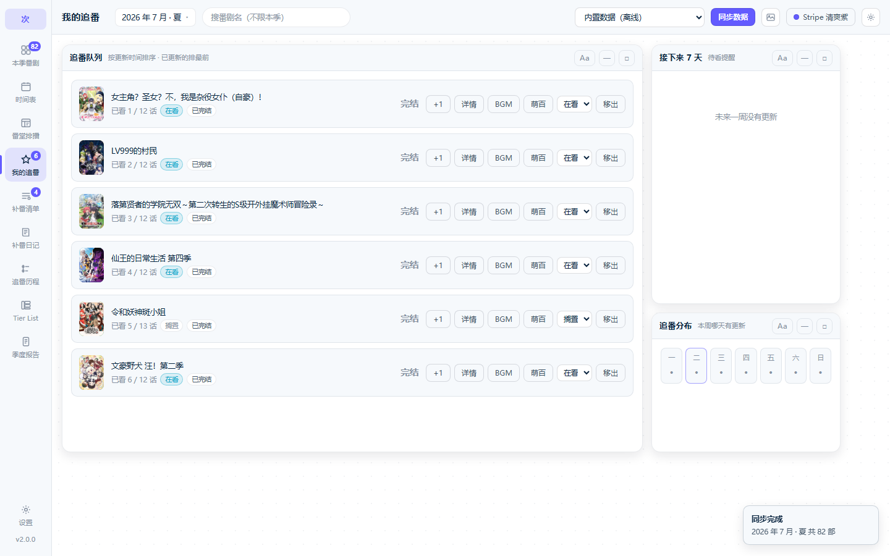

### 补番清单

自己给每部补番设 deadline，卡片显示还剩几天、还剩几话，配三档颜色：逾期红、三天内黄、时间宽裕灰。已补完的排在最后。逾期数量在侧边栏单独计数。

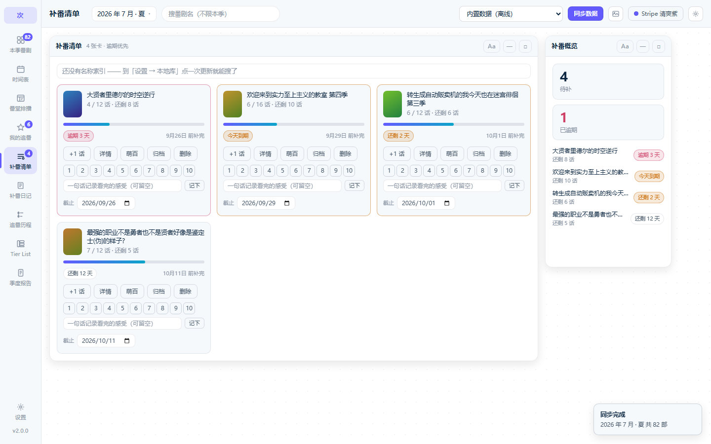

### 补番日记

给补番清单里每一部写观后感。一部可以有多条，逐条记日期和心情，配 1 到 5 星。日记数据跟着备份走，换机器不丢。

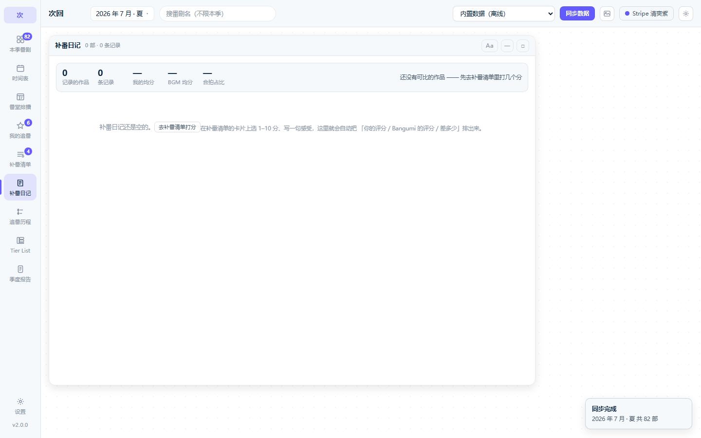

### 追番历程

把「什么时候开始追、追了多少话、看完了哪些」按时间铺开，配一张完成度曲线。

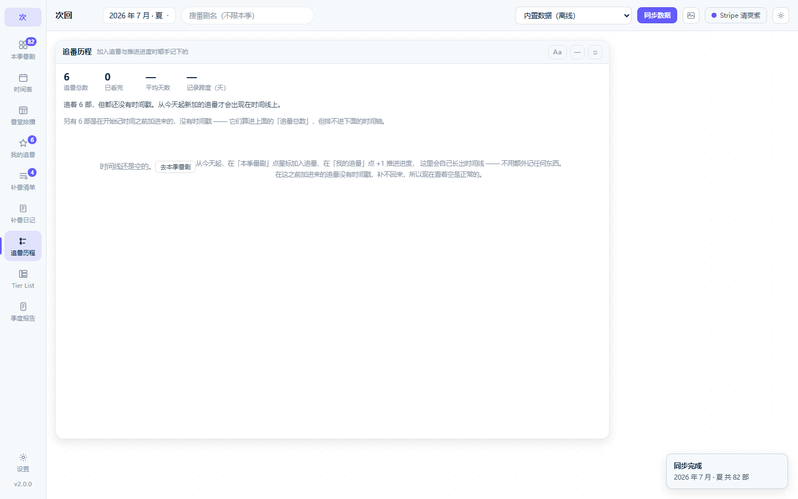

### Tier List

把一季的番剧拖进 S 到 E 分档，可以按评分自动排，也可以手动微调，最后导出成一张长图。

档位模板有四套预设，外加一套自己定义的：档位行能自己加、自己删，每行的标题和颜色都能改。自定义模板下的排布跟预设是同一套数据，切回去不丢。

自定义模板里可以导入图片，官方视觉图、插画、截图都行，和番剧条目一样拖进档位。

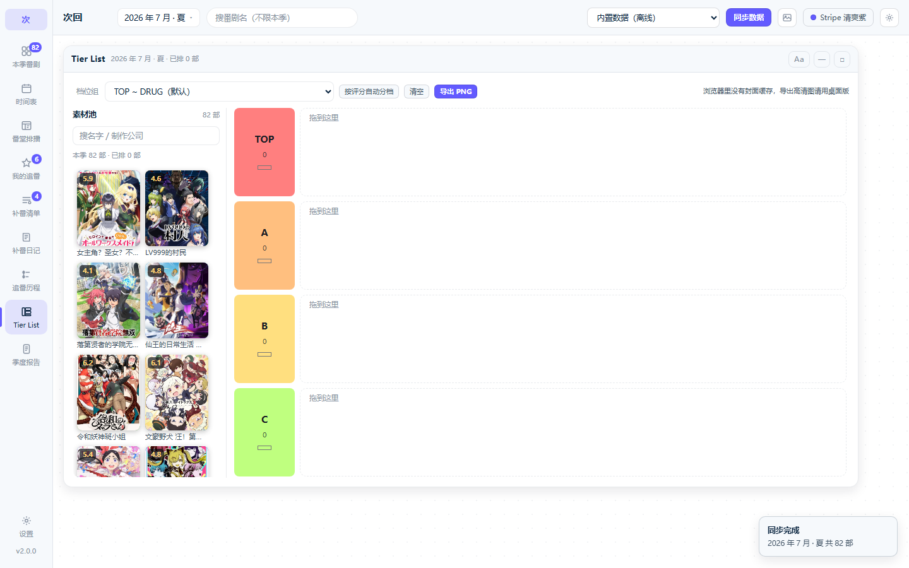

### 季度报告

把一季的番剧拼成一张可编辑的长图。标题、正文、数据块、封面墙、奖项都是一种「块」，能加能删能拖动排序。

奖项那块能自己挑封面大小（160 到 460），每一块的正文字号也有小到特大五档，同一份报告里每块可以不一样。

封面取原图那一档。断网取不到原图时用缩略图。

「＋ 自定义图片」用来导入插画和截图，导入的图片和封面一样放进块里。

画布默认按窗口宽度缩放到一屏能看全。按 `1:1` 回到原始比例，或用 `−` / `＋` 自己调。缩放只影响预览，导出的是原始尺寸。

导出倍率有跟随屏幕、1x、1.5x、2x 四档，决定用多少物理像素装这张画布。导出前会算一次封面覆盖率，缺图时不给导出。

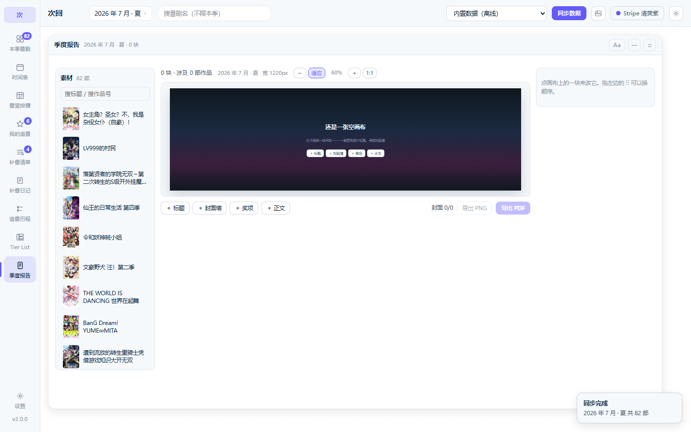

### 导出与迁移

设置的数据源页有两条路：

- 导出备份…：一份几十 KB 的 JSON，里面是追番、进度、补番、日记、档位表、报告和设置
- 导出文件包…：把这次要交出去的东西收进一个目录，里面是数据备份、当季报告长图，还有一份写着「怎么用」的说明

换台设备时用「从备份导入…」，整份替换（不是合并），覆盖前会自动把本机现有记录另存一份。封面缓存和壁纸不跟着走，那两个换机器重新下一次就有了。

### 布局

界面由卡片组成，位置和大小都能拖，改动自动保存。自带 4 套预设：默认宽屏双栏、专注主卡优先、纵向堆叠、紧凑小窗总览。当前摆位可以存成自己的预设，能重命名、删除、导出成 JSON 再导回。窗口宽度小于 1180px 时卡片改成单列堆叠。

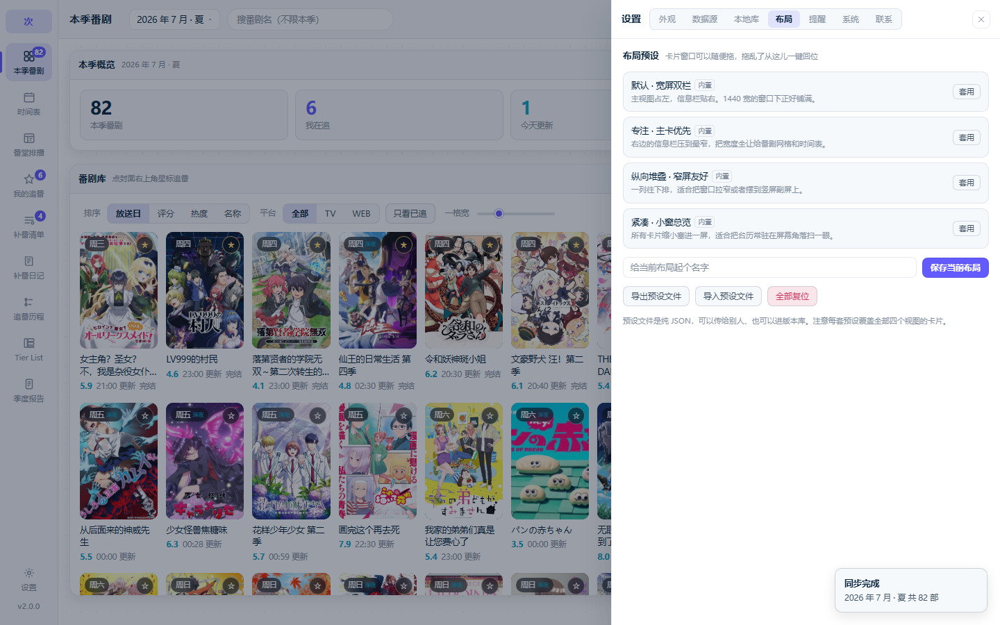

### 显示比例

每张卡片标题栏右上角有个「内容大小」按钮，点开是右下角一个浮动调节盘，里面有封面尺寸和文字大小两条滑块。

调的是内容不是窗口。窗口本身不管怎么拉，里面的封面和字号都不变；而这两条滑块是全站共用的，在本季番剧里拉一下，Tier List、追番、日记、报告里也跟着变。默认档就是原来的样子。

### 主题

共九套，分三组：

| 分组 | 主题 |
| --- | --- |
| 默认 | 夜航 |
| 简洁 | Linear 极客黑、Notion 柔和白、Raycast 深邃蓝、Stripe 清爽紫 |
| ACG | 赛博霓虹、樱雪和风、马卡龙萌系、机甲战术风 |

换肤按钮在顶栏，快捷键 `T` 同样可以轮换。

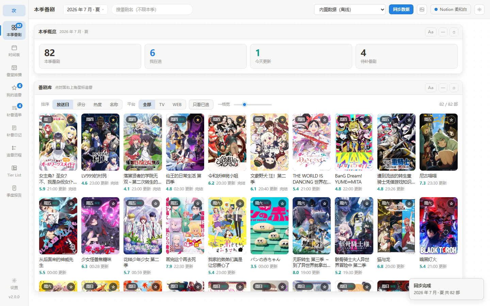

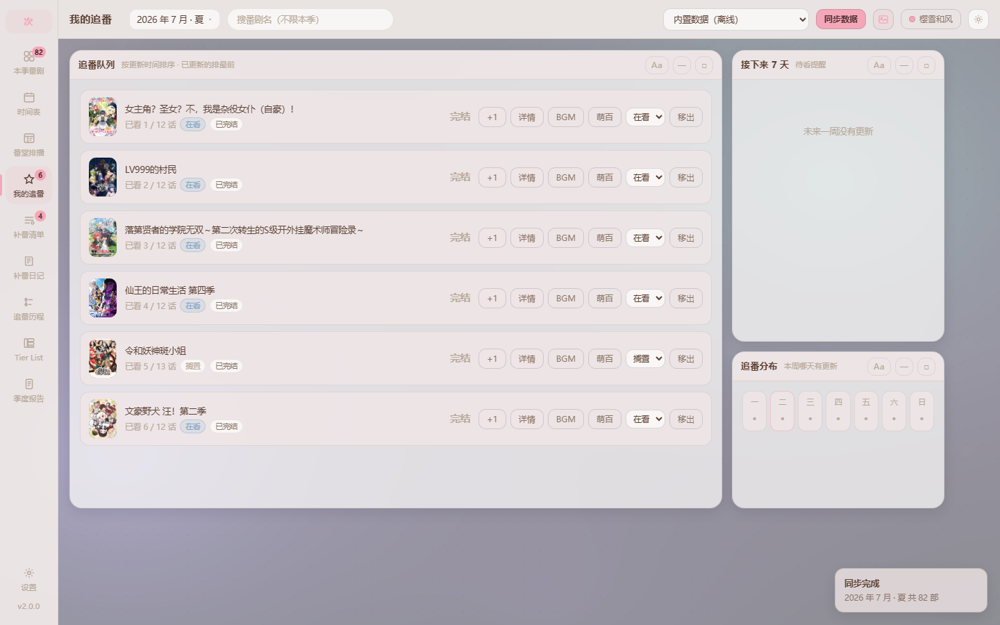

### 壁纸

选一张本地图片做背景，自动缩到长边 1920 后保存。可调六项：不透明度、模糊、亮度、缩放、位置、暗角。卡片和侧栏的不透明度能单独压低，让壁纸透出来。位置用一个取景框拖。

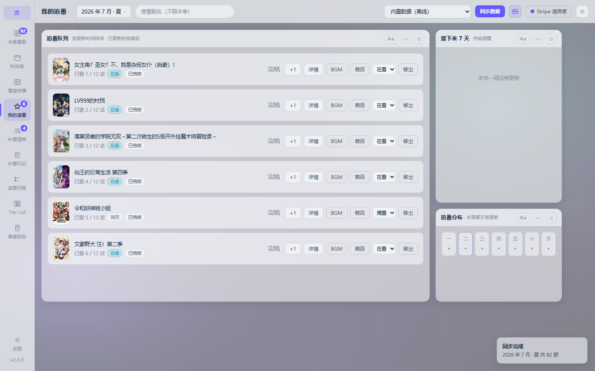

### 托盘

关闭窗口后进入托盘继续运行，不退出。图标上带数字角标，显示今天有几部更新；托盘菜单显示今天几部更新、待补几部、已逾期几部，可以直接跳到对应视图。

支持开机自启，开机时带 `--hidden` 参数，不弹窗口。全局快捷键默认 `Ctrl+Shift+A`，在其他程序前台时也能呼出主窗口。

## 页面

九个视图，由左侧栏切换：

| 视图 | 包含的内容 |
| --- | --- |
| 本季番剧 | 本季概览、番剧库 |
| 时间表 | 播出时间表、今日更新 |
| 番堂排播 | 番堂排播表、作品资料 |
| 我的追番 | 追番队列、接下来 7 天、追番分布 |
| 补番清单 | 补番清单、补番概览 |
| 补番日记 | 日记编辑与条目列表 |
| 追番历程 | 时间轴与完成度 |
| Tier List | 分档面板与素材池 |
| 季度报告 | 画布、块面板、导出 |

点任意一张卡片从右侧打开详情抽屉，里面有简介、标签、话数，以及 Bangumi 和萌娘百科的外链。按 `?` 打开快捷键面板。

设置面板按 `,` 打开，共七个标签页：

| 标签页 | 内容 |
| --- | --- |
| 外观 | 主题切换、壁纸与六项参数、卡片内容比例、性能 |
| 数据源 | 三档数据源、代理、网络诊断、备份与迁移 |
| 本地库 | 季度目录、名称索引、封面缓存 |
| 布局 | 预设切换与保存、导入导出 |
| 提醒 | 关窗与最小化的行为、开机自启、全局快捷键 |
| 系统 | 季度缓存清理、隐藏功能列表、本机路径 |
| 联系 | 作者邮箱与 GitHub |

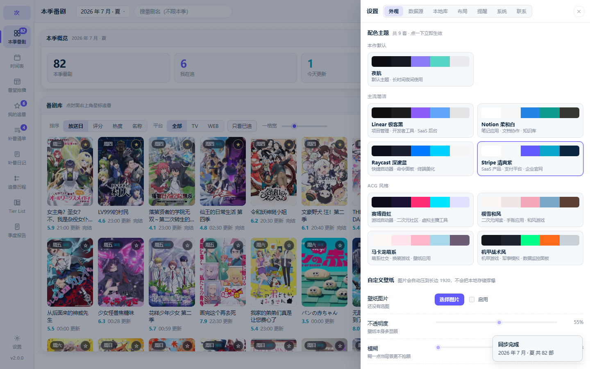

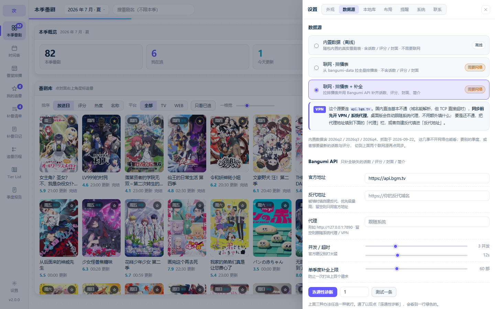

## 快捷键

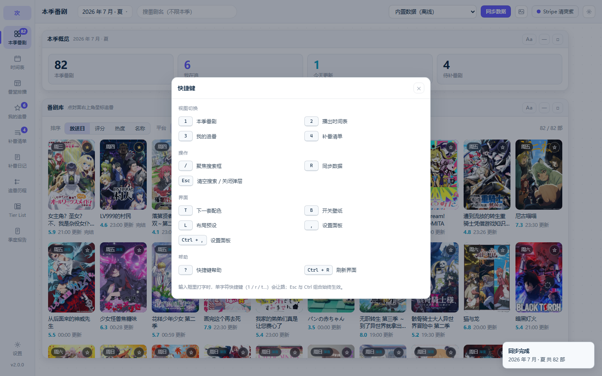

| 按键 | 作用 |
| --- | --- |
| `1` `2` `3` `4` | 切换四个主视图 |
| `/` | 聚焦搜索框 |
| `R` | 同步当前季度 |
| `T` | 轮换配色主题 |
| `B` | 开关壁纸 |
| `L` | 打开布局预设 |
| `,` | 打开设置 |
| `?` | 打开快捷键面板 |
| `Esc` | 清空搜索、关闭浮层 |
| `Ctrl+R` | 刷新界面 |
| `Ctrl+Shift+A` | 全局呼出主窗口 |

光标在输入框里时，单字符快捷键不生效。

## 运行

需要 Node.js 18 以上。

```bash
npm install
npm run desktop
```

也可以双击仓库根目录的 `启动次回.bat`，它会检查依赖和构建产物，缺的自己补上。

自己打包：

```bash
npm run dist:win
```

产物在 `release/`。这一步会先跑 `npm run assets` 生成图标和 `.ico`、`npm run build` 打包界面，再交给 electron-builder。

electron-builder 第一次跑要从网上下 NSIS 和 7-Zip 的二进制，国内建议先设镜像：

```bash
export ELECTRON_BUILDER_BINARIES_MIRROR=https://npmmirror.com/mirrors/electron-builder-binaries/
```

⚠️ 重打包前先把上一个 `release/` 挪走或删掉。目录已存在时 Windows 上可能因为文件被占用而报「访问被拒绝」，报错信息完全看不出是这个原因。

如果连「挪走」都被拒，说明目录被系统锁住了，换一个输出目录即可：

```bash
npm run assets && npm run build && npx electron-builder --win --x64 --config electron-builder.yml --config.directories.output=release-out
```

`release/` 和 `release-out/` 都在 `.gitignore` 里，产物不会进仓库。

## 数据

设置里可以选三档数据源，默认是自带数据：

| 数据源 | 说明 |
| --- | --- |
| 自带数据（默认） | 2026 年 4 / 7 / 10 月三个季度共 219 部，含封面，离线可用 |
| bangumi-data | 拉取真实番剧表，只有排播信息 |
| bangumi-data + Bangumi API | 补上话数、评分、封面、简介、制作公司 |

自带数据来自 [bangumi-data](https://github.com/bangumi-data/bangumi-data)（CC BY 4.0）与 Bangumi v0 API。

封面素材图包：仓库里的 `build/covers/` 是随包那 219 部的封面缩略图（150×212，一共 2.4MB），打包时会作为 `extraResources` 带进安装包，程序第一次启动把它们种进本地缓存，所以装完第一次打开不联网也有图。种子只补不覆盖，不覆盖已有的图。重新抓一遍用 `npm run covers`，验收用 `npm run check:coverseed`。

联网需要代理，桌面版自动跟随系统代理，也可以在数据源页手填代理地址或自建反代。数据源页有网络诊断按钮，连接错误会显示成中文说明。拉取失败时界面顶部挂横幅，说明当前看到的是哪份数据。

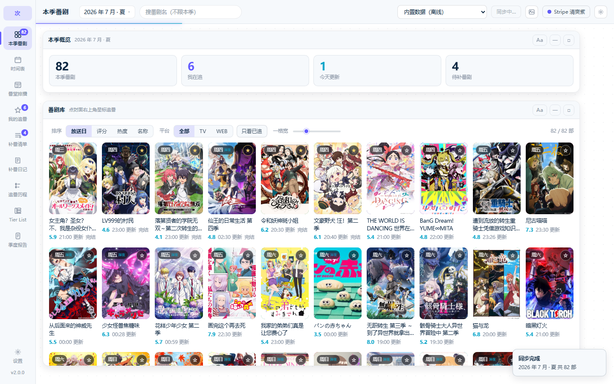

季度缓存和用户数据分开存，缓存最多保留 10 个季度，超出淘汰最旧的，可以在本地库页查看和清理。用户数据在 Electron 的用户数据目录下，Windows 上是 `%APPDATA%\jikai\`。

## 已知限制

- 安装包没有代码签名，首次运行会遇到 SmartScreen 提示
- 自动更新只做到「检查 + 跳去下载」，入口当前收起，代码在、通道在，但还没有稳定的更新源
- 只适配 Windows，macOS 和 Linux 未验证
- 换主题没有过渡动画
- 壁纸单张上限约 3.2MB，只存一份，不分视图
- 报告长图单边超过 16384 像素会自动降比例，界面会写降到了多少；倍率调高，文件也跟着变大
- 报告用 Bangumi 的封面原图，条目本身没有高清封面时只能拿到缩略图那档

## 联系

邮件：`liam.zhong` + `@` + `foxmail.com`

GitHub：[@liamzhong-dev](https://github.com/liamzhong-dev)

## 许可

代码以 MIT 许可发布，见 [LICENSE](LICENSE)。

番剧数据来自 bangumi-data（CC BY 4.0）与 Bangumi v0 API，版权归原作者所有。本作与 Bangumi 官方无关。
